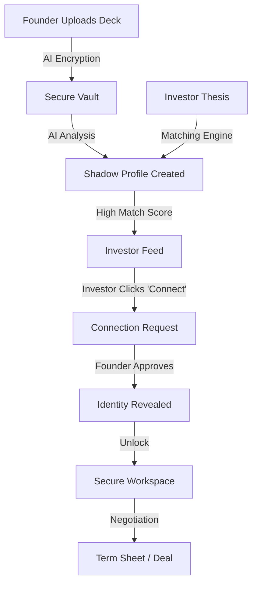
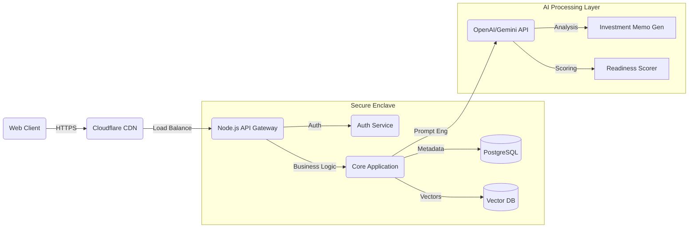

# FundLink: The Privacy-First AI Investment Banker

> **Hackathon Submission - Feb 2026**
> *Bridging the gap between privacy-conscious founders and signal-seeking investors using Asymmetric AI Matchmaking.*

---

## 📋 Table of Contents
1.  [Problem Statement](#1-problem-statement)
2.  [Solution Analysis](#3-solution-analysis)
3.  [Key Features](#4-list-of-features)
4.  [Architecture & Tech Stack](#6-architecture-diagram)
5.  [Getting Started (Usage Info)](#9-getting-started)
6.  [Project Structure](#10-project-structure)
7.  [Cost Estimates](#8-estimated-implementation-cost-suturescale)

---

## 1. Problem Statement
**The "Cold Start" Problem in Venture Capital**
Early-stage fundraising is broken.
*   **Founders** spam thousands of investors with cold emails, risking idea theft and reputation damage.
*   **Investors** drown in low-quality deal flow, missing diamonds in the rough because they rely on warm intros (the "Old Boys' Club").
*   **Trust Gap**: There is no safe space for initial discovery without exposing sensitive IP or financial data.

## 2. Brief about the Idea
**FundLink** is an asymmetric, AI-driven matchmaking platform. It acts as an automated "Investment Banker" that sits between Founders and Investors.
*   **Founders** upload sensitive data (Pitch Decks, financials) into a secure vault.
*   **Investors** define their thesis (Sector, Stage, Check Size).
*   **The AI** matches them blindly. The Investor sees a "Shadow Profile" (metrics without identity). They must request access. The Founder must approve the connection before *any* name or sensitive data is revealed.

## 3. Solution Analysis

### How is it different?
| Feature | Traditional Platforms (LinkedIn/AngelList) | FundLink |
| :--- | :--- | :--- |
| **Discovery** | Public Profiles (High Noise) | Blind/Shadow Profiles (Signal Focus) |
| **Privacy** | Open by Default | Closed by Default (Zero-Trust) |
| **Matching** | Keyword Search | Semantic AI Analysis & "Readiness" Scoring |
| **Access** | Direct Messaging | Mutual "Unlock" Handshake (NDA Simulation) |

### How does it solve the problem?
*   **Eliminates Bias**: Investors judge the *business metrics* and *idea* first, not the founder's pedigree or location.
*   **Protects IP**: Founders no longer fear their deck being forwarded to competitors.
*   **Increases Efficiency**: The "Senior Analyst" AI pre-screens deals, saving investors 20+ hours of due diligence per week.

### Unique Selling Proposition (USP)
1.  **"Asymmetric Privacy"**: You don't know who I am until we *both* agree to talk.
2.  **AI Due Diligence**: An automated "Senior Associate" that generates SWOT SWOTs, Risk Assessments, and Investment Theses in seconds.
3.  **Secure Negotiation Workspace**: A built-in "Clean Room" for chatting and viewing docs without allowing downloads.

## 4. List of Features
*   **Founder Readiness Engine**: AI analyzes pitch decks to give a 0-100 "Fundability Score" and gap analysis before they go live.
*   **Investor Shadow Feed**: A dashboard of anonymized opportunities sorted by AI Match Score.
*   **Smart "Unlock" Protocol**: A transactional workflow for revealing identity (Request -> Approve -> Reveal).
*   **Interactive Secure Workspace**: Real-time chat and document simulation for deal negotiation.
*   **Automated Investment Memos**: Instant generation of professional-grade due diligence reports.

## 5. Process Flow


## 6. Architecture Diagram


## 7. Technology Stack
*   **Frontend**: HTML5, Vanilla JavaScript (ES6 Modules), Tailwind CSS (via CDN for portability).
*   **Backend**: Node.js with Express (REST API).
*   **AI/ML**: Integration ready for OpenAI/Gemini (Simulated in Demo).
*   **Database**: PostgreSQL (User Data), Pinecone (Vector Embeddings).
*   **Security**: Role-Based Access Control (RBAC), AES-256 standard.

---

## 9. Getting Started

### Prerequisites
*   Node.js (v16+)
*   npm (v8+)
*   Modern Browser (Chrome/Edge/Firefox)

### Installation
1.  **Clone the Repository**
    ```bash
    git clone https://github.com/your-org/fundlink.git
    cd fundlink
    ```

2.  **Install Dependencies**
    ```bash
    npm install
    ```

3.  **Run the Application**
    ```bash
    node backend/server.js
    ```

4.  **Access the Demo**
    Open your browser and navigate to: `http://localhost:3000`

### Usage Guide
*   **Public Landing**: Start here to choose your role (`Founder` or `Investor`).
*   **Investor Demo**:
    *   View "Shadow Profiles".
    *   Click **"Analyze AI"** to see the Due Diligence Report.
    *   Click **"Connect"** to request access.
*   **Founder Demo**:
    *   Go to Dashboard -> Profile.
    *   Click **"Analyze Profile"** to get a Readiness Score.
    *   Go to **Inbox** to approve investor requests.

---

## 10. Project Structure
```text
fundlink/
├── backend/
│   ├── server.js            # Node.js Express Server
│   └── controllers/         # API Logic (AI, Auth)
├── frontend/
│   ├── assets/              # Images, Icons
│   └── *.html               # Dynamic HTML Templates (loaded by JS)
├── js/
│   ├── main.js              # Application Bootstrap & Routing
│   ├── modules/
│   │   ├── AIClient.js      # AI Simulation & API Client
│   │   └── Auth.js          # Authentication & RBAC
│   └── pages/               # Page Renderers (SPA Logic)
├── index.html               # Single Page Application Entry Point
└── README.md                # This file
```

---

## 8. Estimated Implementation Cost (Suture/Scale)

### 1. Infrastructure (Monthly)
*   **Compute (Cloud Run / Vercel)**: $50 - $150 (Auto-scaling)
*   **Database (Managed Postgres)**: $60 (Production grade)
*   **Vector Database**: $70 (For managing 10k+ startups)
*   **Cloud & Data Servers (Enterprise Reserve)**: $42,000 (Dedicated GPU Clusters & Data Sovereignty compliance)
*   **Total Infra**: ~$42,300 / month

### 2. AI Costs (Usage Based)
*   **Input/Output Tokens**: Est. $0.05 per pitch deck analysis.
*   **Scale**: For 1,000 decks/month = ~$50.
*   **Total AI**: ~$100 / month.

### 3. Team (MVP Phase - 3 Months)
*   **1 Full Stack Lead**: $8k/mo
*   **1 AI Engineer**: $10k/mo
*   **1 UX/Product Designer**: $6k/mo
*   **Total Labor**: $72,000 (3-month sprint)

### **Grand Total Cost**:
*   **Total (Infra + AI + Team)**: **$200,000**
    *   *(Includes 3-month Labor + Enterprise Cloud/Data Server Reserves)*

---
*FundLink System Architecture v1.0*
