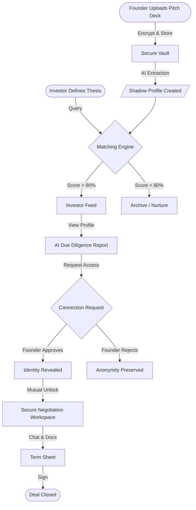
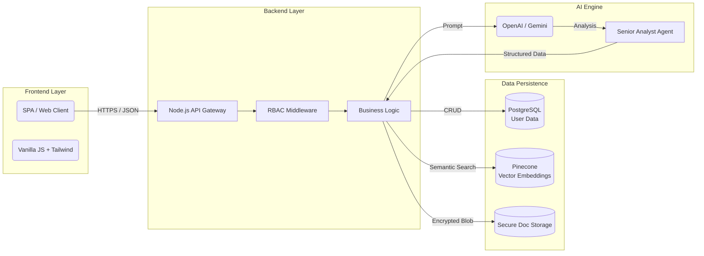
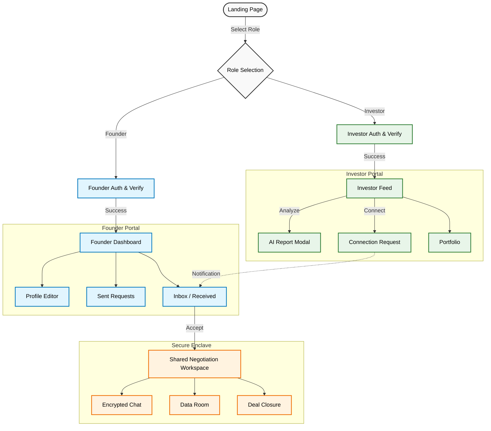
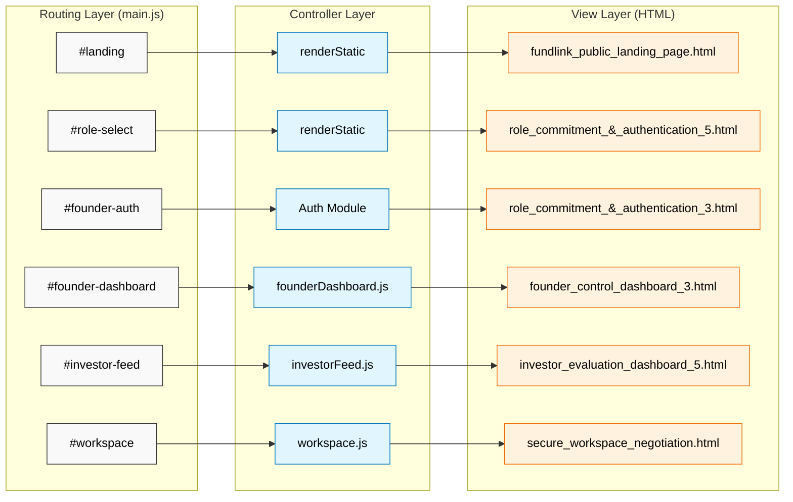

# FundLink: Watch and Connect

> *Bridging the gap between privacy-conscious founders and signal-seeking investors using Asymmetric AI Matchmaking.*
>
> ---
>
> # 🇮🇳 Empowering Bharat: The Engine of Economic Resurgence
>
> ### **"Indigenous Innovation. Global Impact."**
>
> India stands at the precipice of a golden era. Yet, a critical blockage remains: **The GDP-Job Mismatch**.
>
> 📉 **The Challenge**:
> While our GDP grows, the biggest fallback remains the stagnation in high-quality job creation. Thousands of brilliant, indigenous ideas die in infancy not because they lack potential, but because they lack access to the *right* capital. This capital inefficiency stifles the emergence of new enterprises, which are the primary engines of employment.
>
> 🚀 **The FundLink Solution**:
> **FundLink** is more than a platform; it is a **National Economic Accelerator**.
> *   **Right & Perfect Capital**: We don't just provide funding; we ensure the *right* capital meets the *perfect* idea. Our AI precision eliminates mismatch, ensuring value-add partnerships.
> *   **For Every Stage Entrepreneur**: Whether you are an ideation-stage dreamer in a Tier-3 city or a Series-A scaler in Bengaluru, our "Readiness Engine" guides you to the next level.
> *   **Unlocking Liquidity**: By making investing safer and more efficient, we unlock dormant domestic capital.
> *   **The Growth Loop**:
>     1.  **Efficient Funding** -> More Startups Survive.
>     2.  **More Startups** -> Massive Job Creation (Tier 1, 2 & 3 Cities).
>     3.  **More Jobs** -> Higher Consumer Spending -> **GDP Surge**.
>
> 🔮 **Future Vision: The Talent Pipeline**
> Our roadmap includes a unified **Job Connect Portal**. This will be a privileged pipeline for Indian talent to find roles directly within these newly funded, high-growth ventures. By linking Funding to Hiring, we ensure that capital inflow directly translates to livelihood generation for the youth of India.
>
> ---

---

## 📋 Table of Contents
1.  [Problem Statement](#1-problem-statement)
2.  [Solution Analysis](#3-solution-analysis)
3.  [Key Features](#4-list-of-features)
4.  [Architecture & Tech Stack](#6-architecture-diagram)
5.  [Getting Started (Usage Info)](#9-getting-started)
6.  [Project Structure](#10-project-structure)
7.  [Cost Estimates](#8-estimated-implementation-cost-suturescale)

---

## 1. Problem Statement
**The "Cold Start" Problem in Venture Capital**
Early-stage fundraising is broken.
*   **Founders** spam thousands of investors with cold emails, risking idea theft and reputation damage.
*   **Investors** drown in low-quality deal flow, missing diamonds in the rough because they rely on warm intros (the "Old Boys' Club").
*   **Trust Gap**: There is no safe space for initial discovery without exposing sensitive IP or financial data.

## 2. Brief about the Idea
**FundLink** is an asymmetric, AI-driven matchmaking platform. It acts as an automated "Investment Banker" that sits between Founders and Investors.
*   **Founders** upload sensitive data (Pitch Decks, financials) into a secure vault.
*   **Investors** define their thesis (Sector, Stage, Check Size).
*   **The AI** matches them blindly. The Investor sees a "Shadow Profile" (metrics without identity). They must request access. The Founder must approve the connection before *any* name or sensitive data is revealed.

## 3. Solution Analysis

### How is it different?
| Feature | Traditional Platforms (LinkedIn/AngelList) | FundLink |
| :--- | :--- | :--- |
| **Discovery** | Public Profiles (High Noise) | Blind/Shadow Profiles (Signal Focus) |
| **Privacy** | Open by Default | Closed by Default (Zero-Trust) |
| **Matching** | Keyword Search | Semantic AI Analysis & "Readiness" Scoring |
| **Access** | Direct Messaging | Mutual "Unlock" Handshake (NDA Simulation) |

### How does it solve the problem?
*   **Eliminates Bias**: Investors judge the *business metrics* and *idea* first, not the founder's pedigree or location.
*   **Protects IP**: Founders no longer fear their deck being forwarded to competitors.
*   **Increases Efficiency**: The "Senior Analyst" AI pre-screens deals, saving investors 20+ hours of due diligence per week.

### Unique Selling Proposition (USP)
1.  **"Asymmetric Privacy"**: You don't know who I am until we *both* agree to talk.
2.  **AI Due Diligence**: An automated "Senior Associate" that generates SWOT SWOTs, Risk Assessments, and Investment Theses in seconds.
3.  **Secure Negotiation Workspace**: A built-in "Clean Room" for chatting and viewing docs without allowing downloads.

## 4. List of Features
*   **Founder Readiness Engine**: AI analyzes pitch decks to give a 0-100 "Fundability Score" and gap analysis before they go live.
*   **Investor Shadow Feed**: A dashboard of anonymized opportunities sorted by AI Match Score.
*   **Smart "Unlock" Protocol**: A transactional workflow for revealing identity (Request -> Approve -> Reveal).
*   **Interactive Secure Workspace**: Real-time chat and document simulation for deal negotiation.
*   **Automated Investment Memos**: Instant generation of professional-grade due diligence reports.
*   **Accepted Connections Workspace**: A dedicated workspace for accepted connections to communicate, share documents, and manage deal disclosure with connected partners.

## 5. Process Flow


## 6. Architecture Diagram


## 7. Technology Stack
*   **Frontend**: HTML5, Vanilla JavaScript (ES6 Modules), Tailwind CSS (via CDN).
*   **Backend**: Node.js with Express (REST API).
*   **AI/ML**: Integration ready for OpenAI/Gemini (Simulated in Demo).
*   **Database**: PostgreSQL (User Data), Pinecone (Vector Embeddings).
*   **Security**: Role-Based Access Control (RBAC), AES-256 standard.

---

## 9. Getting Started

### Prerequisites
*   **Node.js**: v16.0.0 or higher
*   **npm**: v8.0.0 or higher
*   **Web Browser**: Chrome, Edge, or Firefox (Latest)

### Installation & Run Guide

Follow these steps to get the project running on your local machine:

1.  **Clone the Repository**
    ```bash
    git clone https://github.com/your-org/fundlink.git
    cd fundlink
    ```

2.  **Install Dependencies**
    ```bash
    npm install
    ```

3.  **Run the Application**
    Start the server:
    ```bash
    npm start
    ```
    *The server will start on port 3000 by default.*

4.  **Access the Platform**
    Open your web browser and go to:
    **`http://localhost:3000`**

### User Usage Scenarios

#### Scenario A: The Founder Journey (Seeking Capital)
1.  **Landing**: On the homepage, click **"Enter the Protocol"**.
2.  **Role Selection**: Choose **"Startup Founder"**.
3.  **Identity Verification**:
    *   Enter a professional email (e.g., `founder@startup.com`).
    *   Complete the "Strategic Verification" form (Stage, Sector, Ask).
4.  **Dashboard**:
    *   Navigate to **Profile** to view your "Readiness Score" generated by AI.
    *   Go to **Sent Requests** to manage your outreach.
    *   Check **Inbox** for incoming investor connections.

#### Scenario B: The Investor Journey (Deploying Capital)
1.  **Role Selection**: Choose **"Professional Investor"** from the landing page.
2.  **Mandate Verification**:
    *   Enter an institutional email (e.g., `partner@vc.firm`).
    *   Define your "Investment Thesis" (e.g., FinTech, Seed Stage, $500k checks).
3.  **Evaluation Feed**:
    *   Browse "Shadow Profiles" of matched startups.
    *   Click **"Analyze AI"** on any deal card to generate an instant Deep Dive Report.
    *   Click **"Connect"** to request identity reveal and access to the Data Room.

#### Scenario C: The Match & Deal Room
1.  **Connection**: Once a Founder accepts an Investor's request (or vice versa), a match is made.
2.  **Accepted Connections Workspace**:
    *   Both parties gain access to a shared **"Accepted Connections Workspace"**.
    *   View all accepted connections in a unified dashboard.
    *   Use the **"Talk"** tab for secure messaging with connected partners.
    *   Use the **"Deal Disclosure"** tab to manage shared information and deal terms.
    *   Use the **"Documents"** tab to share and view pitch decks, financial models, and term sheets.
    *   Generate AI reports for partnership analysis.
3.  **Deal Closure**:
    *   Use the **"Deal Closure"** module to simulate term sheet negotiations.

---

## ⚖️ Legal & Regulatory Compliance (India Focus)

Building a fintech platform in India requires navigating a complex regulatory landscape. FundLink is designed with "Compliance by Code" architecture.

| Potential Legal Challenge | How We Overcome It (Mitigation Strategy) |
| :--- | :--- |
| **SEBI AIF Regulations**<br>*(Risk of deemed "Unregistered Fund")* | **Tech-First Aggregator Model**: FundLink acts solely as a **discovery & readiness platform**, not a fund manager. We do not pool money. Developing partnerships with SEBI-registered Trustees / AIFs to handle actual capital flow. |
**Closed Ecosystem**: The platform is **NOT** a public equity crowdfunding site. Startups are visible only to KYC-verified, Accredited Investors. The "Shadow Profile" ensures no sensitive offer details are broadcast publicly. |
| **KYC/AML Guidelines**<br>*(PMLA Compliance)* | **Integrated Verification**: Mandatory Aadhaar/PAN verification for all Investors before granting access to the "Deal Room". |

### Deployment
The application is designed to be deployment-agnostic. It can be deployed to any Node.js supported environment (e.g., Vercel, Heroku, AWS).

1.  **Build the application** (if necessary)
2.  **Start the server**
    ```bash
    npm start
    ```


---

## 10. Project Structure
```text
fundlink/
├── backend/
│   ├── server.js            # Node.js Express Server
│   └── controllers/         # API Logic (AI, Auth)
├── frontend/
│   ├── assets/              # Images, Icons
│   └── *.html               # Dynamic HTML Templates (loaded by JS)
├── js/
│   ├── main.js              # Application Bootstrap & Routing
│   ├── modules/
│   │   ├── AIClient.js      # AI Simulation & API Client
│   │   └── Auth.js          # Authentication & RBAC
│   └── pages/               # Page Renderers (SPA Logic)
├── index.html               # Single Page Application Entry Point
└── README.md                # This file
```

## 11. User Interface Flow (Wireframes)
The application follows a strictly defined navigation path based on User Roles.



## 12. Technical Wiring (SPA Routing)
This diagram maps how the **Route** triggers a **Controller**, which then renders a specific **HTML Template**.



## 13. Estimated Implementation Cost (Suture/Scale)

### 1. Infrastructure (Monthly)
*   **Compute (Cloud Run / Vercel)**: $50 - $150 (Auto-scaling)
*   **Database (Managed Postgres)**: $60 (Production grade)
*   **Vector Database**: $70 (For managing 10k+ startups)
*   **Cloud & Data Servers (Enterprise Reserve)**: $42,000 (Dedicated GPU Clusters & Data Sovereignty compliance)
*   **Total Infra**: ~$42,300 / month

### 2. AI Costs (Usage Based)
*   **Input/Output Tokens**: Est. $0.05 per pitch deck analysis.
*   **Scale**: For 1,000 decks/month = ~$50.
*   **Total AI**: ~$100 / month.

### 3. Team (MVP Phase - 3 Months)
*   **1 Full Stack Lead**: $8k/mo
*   **1 AI Engineer**: $10k/mo
*   **1 UX/Product Designer**: $6k/mo
*   **Total Labor**: $72,000 (3-month sprint)

### **Grand Total Cost**:
*   **Total (Infra + AI + Team)**: **$200,000**
    *   *(Includes 3-month Labor + Enterprise Cloud/Data Server Reserves)*

---
*FundLink System README*

---

## 👨‍💻 Author & Contact
**Author**: Potheesh Vignesh K
**Contact**: [kpotheeshvignesh@gmail.com](mailto:kpotheeshvignesh@gmail.com)

